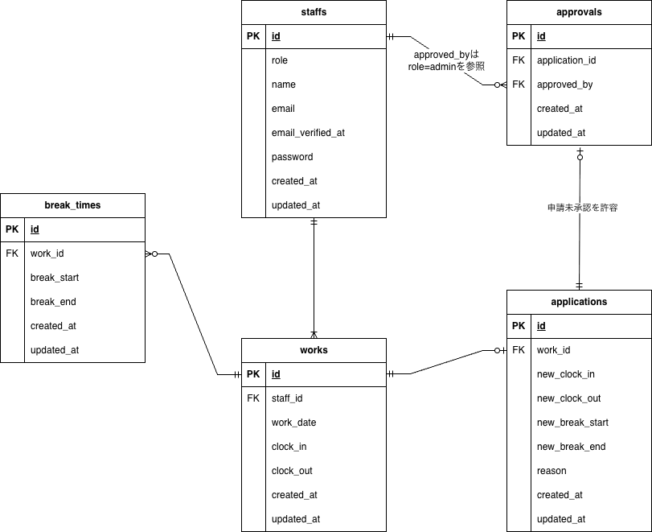

# 💻 attendance-management

Laravel×MySQL×Dockerで構築した勤怠管理アプリです。

---

## アプリ概要
Webアプリ開発の学習過程で制作した勤怠管理アプリです。<br />
スタッフは会員登録・ログイン後、出勤・休憩・退勤の打刻が可能です。<br />
打刻時間に修正がある場合は修正申請より修正可能です。<br />
管理者ユーザーはログイン後、スタッフ一覧を確認でき、スタッフごとの月次勤怠をCSVで出力可能です。<br />
スタッフの日次勤怠を直接修正できるだけでなく、スタッフからの修正申請を承認することができます。<br />

本アプリでは Laravel デフォルトの User モデルは使用せず、<br />
Staff モデルを用いて認証・権限管理を行っています。

---

## 使用技術

|分類|使用技術|
|--------|---------------|
|フレームワーク| Laravel 12.36.1|
|言語|PHP 8.3.27 / HTML / CSS|
|データベース|MySQL 8.0.36|
|インフラ|Docker 28.4.0 / Docker Compose v2.39.4 / Nginx 1.25 / MailHog latest|
|認証| Laravel Fortify|

---

## ER図



---

## 環境構築手順

```bash
#クローン
git clone git@github.com:misaki-sasaki339/attendance-management.git

#Dockerビルド
cd attendance-management
docker compose up -d --build
# ⚠️ Compose V1の場合は下記コマンドでビルドしてください
docker-compose up -d --build

#Laravel環境構築
docker compose exec php bash
composer install
cp .env.example .env
# ⚠️ 重要：docker-compose.ymlファイルをもとに.envファイルのDB設定を修正
php artisan key:generate
php artisan migrate
php artisan db:seed

```

---

## 環境変数の設定（.env）

#.env設定例
```
APP_NAME=Laravel
APP_ENV=local
APP_KEY=base64:xxxxx
APP_DEBUG=true
APP_URL=http://localhost

DB_CONNECTION=mysql
DB_HOST=mysql
DB_PORT=3306
DB_DATABASE=laravel_db
DB_USERNAME=laravel_user
DB_PASSWORD=laravel_pass

MAIL_MAILER=smtp
MAIL_HOST=mailhog
MAIL_PORT=1025
MAIL_USERNAME=null
MAIL_PASSWORD=null
MAIL_ENCRYPTION=null
MAIL_FROM_ADDRESS=example@example.com
MAIL_FROM_NAME="${APP_NAME}"

```

---

## キュー設定について

本アプリでは、ローカル環境での再現性を高めるため  
`.env` の `QUEUE_CONNECTION` を以下のように設定することを推奨しています。

```env
QUEUE_CONNECTION=sync
```

---

## MailHogの設定

本アプリではメール認証(Fortify)を使用しています。
ローカル環境ではMailHogを使用してメール送信を確認できます。

MailHogはdocker-compose.ymlに含まれています。
以下のURLにアクセスしてメールを確認してください。

http://localhost:8025


※ ローカル環境で MailHog を使用した場合、
認証メールが複数表示されることがありますが、
テストおよびアプリ動作には影響ありません。

---

## テストアカウント

一般ユーザー
name:テストスタッフ
email:staff@example.com
password:password123
-------------------------
管理者
name:管理者
email:admin@example.com
password:password123

---

## テストの実施

下記コマンドを実行してください。

```bash
//テスト用データベースの作成
docker compose exec mysql bash
mysql -u root -p
//パスワードはrootと入力
create database demo_test;

docker compose exec php bash
php artisan migrate:fresh --env=testing
./vendor/bin/phpunit
```

---
## 採点者の方へご連絡

テストケースID:6,7,8ですが、機能要件と異なっている箇所があり、
コーチにご相談の上機能要件を正としてテストを行っております。
詳細はスプレッドシートのテストケース一覧にコメント挿入しておりますので、
お手数をおかけしますがご確認くださいますようお願いたします。


